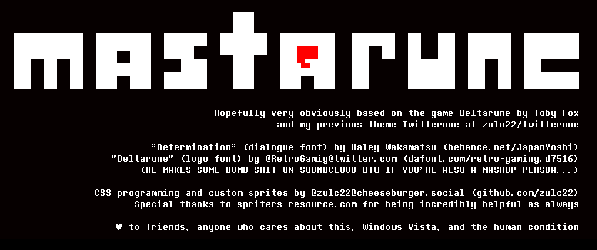

I am unable to provide a link to just "install" the style unlike with the Twitter version, because...
- every Mastodon instance has a different URL (which disallows me from making a prebuilt userCSS style for Stylus)
- there is no built-in user themes system for any branch of Mastodon I know of, and most certainly not in the original branch, which most instances run
- I know of no extension that automatically detects Mastodon instances and injects themes, and I'm not making one just for this.

If you know how to solve these problems make an issue or pull request!

# Installation

For now I'm not writing a fool-proof guide, so hopefully this is good enough. I mean, you probably use Mastodon so this shouldn't be too bad to understand, I would hope.

- Install the "Determination Mono Web" font onto your computer.

unfortunately this requires a local install of the font to function,
and it HAS to be the web version otherwise pixels don't line up right.

[A TTF converted version of the font is available on fontspace](https://www.fontspace.com/determination-mono-web-font-f23209).
Press the three dots next to the Mono Web font and press "Download File".

the original is [on Behance](https://www.behance.net/gallery/31268855/Determination-Better-Undertale-Font).
keep in mind that a WOFF font is not typically one you can locally install,
and may have to be converted to TTF or OTF.

I would use a data: URI for this as with everything else,
but CSP prevents it. (font-src)

- Install [Stylus](https://github.com/openstyles/stylus#releases) onto your 
browser.

- Log in to your instance and make a new theme for it. (click on the
Stylus icon)

- Copy and paste the entirety of [mastarune.css](mastarune.css) into the editor and press save.